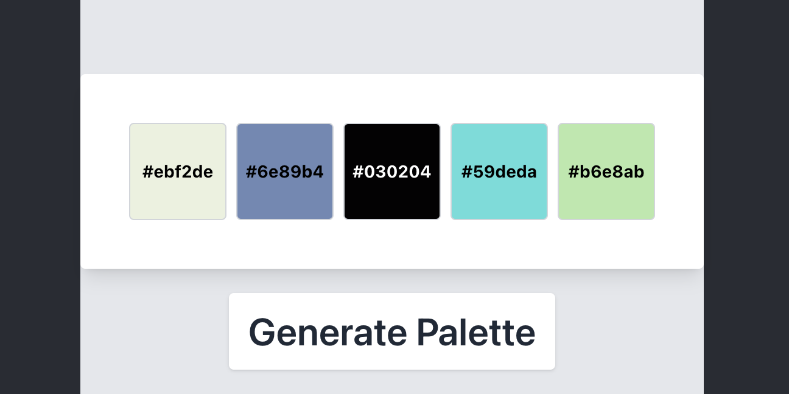

# colorPaletteGenerator

## Overview

The `ColorPaletteSelector` component is a React component designed to generate and display a set of color palettes. It allows users to generate random color palettes based on HSL (Hue, Saturation, Lightness) values and displays the corresponding HEX color codes. The component is built with user experience in mind, ensuring that the color of the text displaying the HEX code contrasts with the background color for optimal readability.

## Features

- **Dynamic Color Generation**: Generates a set of 5 random colors based on HSL values.
- **HEX Code Display**: For each color in the palette, the corresponding HEX code is displayed.
- **Contrasting Text Color**: The text color of the HEX code dynamically changes to either black or white, depending on the background color's brightness, ensuring that the HEX code is always readable.
- **Interactive**: Users can generate a new color palette using a simple button click.

## Example

## How It Works

- The component initializes with a default set of colors.
- Upon clicking the "Generate Palette" button, it generates a new set of random colors.
- Each color is displayed as a square box with the HEX code in the center.
- The brightness of each color is calculated to determine whether the text should be black or white for optimal contrast.